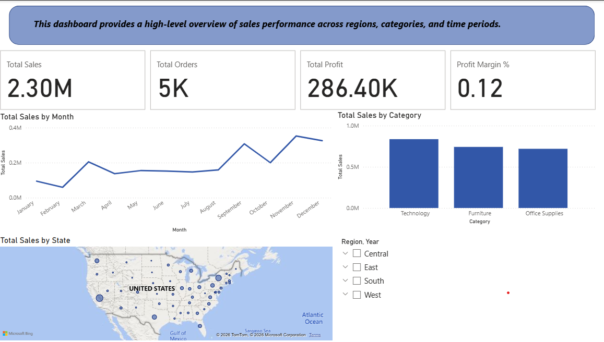
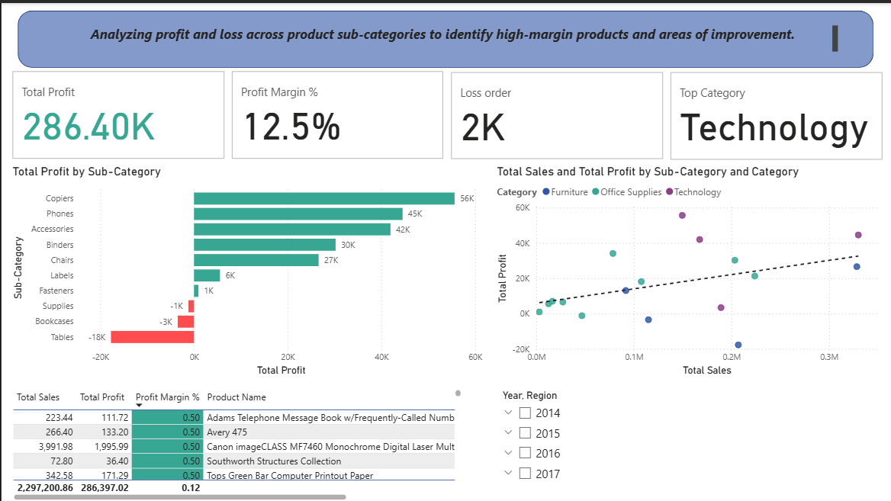
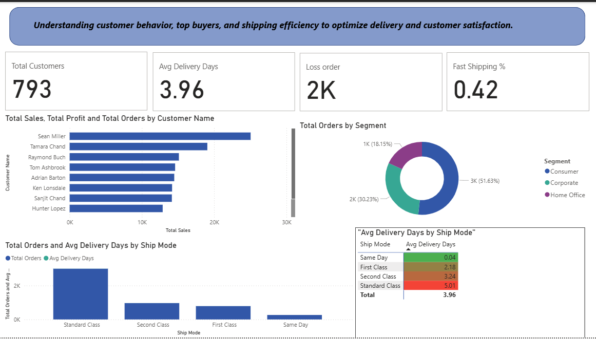

# E-Commerce Sales Dashboard
### 3-Page Interactive Power BI Dashboard — $2.3M in Sales Analyzed

---

## Business Problem

Sales data without structure tells no story. This project transforms raw e-commerce order data into a fully interactive Power BI dashboard that answers the questions every business manager asks daily:

- Where is revenue coming from — and where is it growing?
- Which products and categories are profitable, and which are losing money?
- Who are our best customers, and how efficiently are we shipping?

---

## Dashboard Overview

| Detail | Value |
|--------|-------|
| Tool | Power BI Desktop |
| Dataset | Superstore Sales — 9,994 orders |
| Time Period | 2014 – 2017 |
| Total Sales Analyzed | $2.3M |
| Pages | 3 interactive pages |
| DAX Measures | 7 custom measures |

---

## Page 1 — Sales Overview

> High-level view of overall business performance across regions, categories, and time.



**Visuals included:**
- 4 KPI Cards: Total Sales, Total Profit, Total Orders, Profit Margin %
- Monthly Sales Trend (Line Chart)
- Sales by Category (Bar Chart)
- Sales by State (Map)
- Interactive Slicers: Year + Region

---

## Page 2 — Profitability Analysis

> Deep dive into where the business makes money — and where it loses it.



**Visuals included:**
- Profit by Sub-Category (Bar Chart with conditional Red/Green formatting)
- Sales vs Profit (Scatter Chart with Trend Line)
- Top 10 Products by Profit (Table with conditional formatting)
- Discount vs Profit Impact (Line & Column Chart)

**Key finding:** The Tables sub-category generates **$18K in losses** despite strong sales volume — a clear pricing problem hidden behind headline revenue numbers.

---

## Page 3 — Customer & Shipping Analysis

> Understanding who the customers are and how efficiently orders are fulfilled.



**Visuals included:**
- Top 10 Customers by Sales (Bar Chart)
- Orders by Segment (Donut Chart)
- Ship Mode Performance (Bar + Line)
- Avg Delivery Days by Ship Mode (Matrix with conditional formatting)
- KPI Cards: Total Customers, Avg Delivery Days, Repeat Customers

---

## DAX Measures

| Measure | Formula Summary |
|---------|----------------|
| Total Sales | SUM of all sales |
| Total Profit | SUM of all profit |
| Total Orders | DISTINCTCOUNT of Order IDs |
| Profit Margin % | DIVIDE(Total Profit, Total Sales) |
| Avg Order Value | DIVIDE(Total Sales, Total Orders) |
| LY Sales | CALCULATE with SAMEPERIODLASTYEAR |
| YoY Growth % | DIVIDE(Total Sales - LY Sales, LY Sales) |

---

## Key Business Findings

| Finding | Impact |
|---------|--------|
| West region leads in revenue | $725K — 31% of total sales |
| Tables sub-category loses $18K | Despite being frequently ordered |
| Discounts above 20% consistently produce losses | Discount strategy needs review |
| Standard Class shipping = 60% of all orders | But averages 5 days delivery |
| Consumer segment drives 51% of revenue | Primary target for retention efforts |
| YoY growth positive across all regions | Business is scaling year on year |

---

## Project Structure

```
Superstore-Sales-Dataset/
│
├── SalesDatasets.pbix              <- Power BI file (open with Power BI Desktop)
├── Sample - Superstore.csv         <- Source dataset
├── page1_sales_overview.png        <- Dashboard screenshot
├── page2_profitability.png         <- Dashboard screenshot
├── page3_customers.png             <- Dashboard screenshot
└── README.md
```

---

## How to Open

1. Download and install [Power BI Desktop](https://powerbi.microsoft.com/desktop/) (free)
2. Clone or download this repository
3. Open `SalesDatasets.pbix` in Power BI Desktop
4. Interact with the slicers to filter by Year and Region

---

*Analysis by **Rania Mofeed** | [LinkedIn](https://www.linkedin.com/in/raniamofeed) | [GitHub](https://github.com/RaniaMofeed)*
